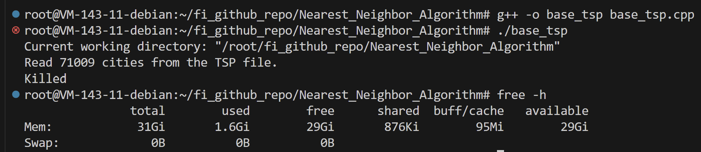
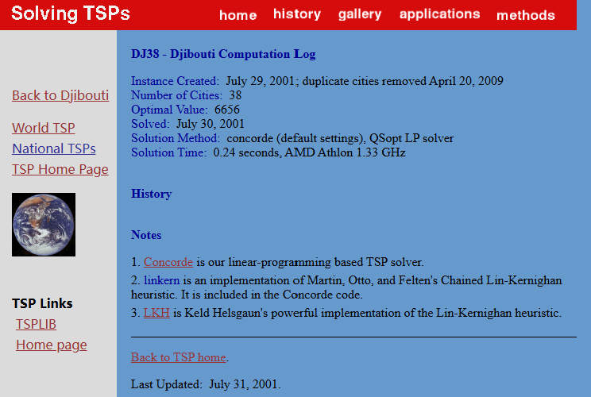
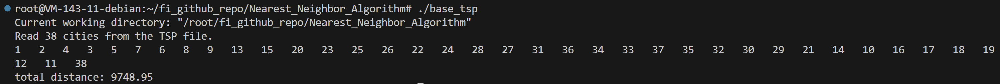

# Nearest_Neighbor_Algorithm
最近邻算法求解 TSP 问题，采取常规的优化思路，对比提升的性能

TSP 的数据集采集自:
https://www.math.uwaterloo.ca/tsp/world/countries.html

# base_tsp: 测试的baseline
比较直接的增量式开发

#### 1. 增加从 .tsp 格式的文件中读取(x,y) 坐标到 std::vector<City> 中

#### 2. 将对应的(x,y) 坐标读入 std::vector<City> 之后，创建二维的距离矩阵，类型是 std::vector<std::vector<double>>
这个距离矩阵的计算很直接，计算上半矩阵的距离值，然后对称映射到下半矩阵。
距离计算过程的步骤形如:
```cpp
std::vector<std::vector<double>> distanceMatrix(cities.size(), std::vector<double>(cities.size(), 0.0));
for(int i = 0; i < cities.size(); i++){
    for(int j = i + 1; j < cities.size(); j++){
        double x_diff = cities[i].x - cities[j].x;
        double y_diff = cities[i].y - cities[j].y;
        double distance = std::sqrt(x_diff * x_diff + y_diff * y_diff);
        distanceMatrix[i][j] = distance;
        distanceMatrix[j][i] = distance;
    }
}
```
这个步骤对于 ch71009.tsp 的测试集来说，运行结果直接报 killed



### 分析 v0.0: 关于 ch71009.tsp 运行报 killed 的原因
> 内存不足
对于每个城市对之间的距离进行计算，存储 double 类型的值。存储一个完整的距离矩阵，对于 71009 个城市来说，
所需的空间是 71009 * 71009 * 8(double 值占用的空间)。
所需要的总内存大约是 (71009 * 71009 * 8) / （1024 * 1024 * 1024）GB = 37.5679 GB
大约需要 38 GB 的内存仅仅用于存储这个矩阵。
观察对应系统的 RAM, 使用
```bash
free -h
```
使用该命令显示系统内存的使用情况，包括物理内存(RAM)和交换空间(Swap)。
这里显示我的总物理内存大小为 31Gi, 问题出在内存空间不足。

#### 3. 实现最近邻算法，设置 visited 和 visited_cities_id 数组，从第一个城市开始，寻找距离最近的城市，逐次添加到访问序列中
这次的两个遗留问题:
1. 写法上，文件格式的读取不够灵活。可以写成命令行加上 ./base_tsp 文件路径名称
2. 计算结果的问题，对 dj38.tsp, 这里最近邻算法的结果是 9748.95, 网站上公布的最优化旅行商计算结果是 6656
目前认为应该是算法只能实现局部最优，而不是全局最优。
对照下面两个结果集合





同样一组数据集，使用 bm33708.tsp, 最近邻算法得到的路径长度为 1203410, 网站上公布的最优结果是 959289,
路径的准确率在 79.714228%, 认为这个计算结果不能令人满意。

| 城市数据集 | 最近邻算法结果 | 网站数据的 benchmark |  准确率   | 
|-----------|---------------|---------------------|-----------|
| bm33708   |  1203410      |   959289            |  79.71423%|
|  dj38     |  9748.95      |   6656              |  68.27402%|

目前的结论是，最近邻算法是贪心的局部最优解，数据集的空间分布特征影响算法的准确率，从实验结果看，算法的准确率不到 80%。

#### version 4. 修改灵活输入，现在程序运行的命令是 ./base_tsp <tsp文件名>
打算以这一个版本为 base, 先进行运行速度上的优化。

## 性能分析工具
采用 likwid, 具体的介绍写在

[likwid usage](/likwid.md)

# optimized_tsp 优化部分

## 1. 最直观的访问上的修改
对于原来的 calculate_distanceMatrix, 注意到需要求解距离矩阵，
在每个 for(int j = i + 1; ...) 的内层循环中，需要读取 cities.size() 次的 cities[i].x 和 cities[i].y

最简单的优化是，将读取 cities[i].x 和 cities[i].y 放在 for 循环之外，降低对 cities[i].x 和 cities[i].y 的读取次数。