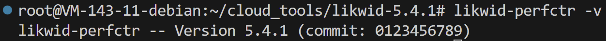
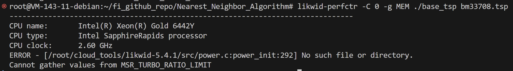

# 实验的性能分析打算采用 likwid

https://github.com/RRZE-HPC/likwid

## likwid 的介绍
likwid 使用 GNU make 和 Perl 构建。包含了 Lua 解释器和 hwloc 库的副本(Hardware Locality), 专注于提供硬件拓扑结构信息。

https://github.com/open-mpi/hwloc

> hwloc(Hardware Locality) 实现的一个愿景:
hwloc 提供命令行工具和 C API 以获取节点内关键计算元素的层次化映射，如: NUMA 内存结点、共享缓存、处理器包、芯片和核心、处理单元(逻辑处理器或“线程”)，
甚至 I/O 设备。hwloc 还收集了各种属性，例如缓存和内存信息，并且可以在多种不同的操作系统和平台间移植。

## 下载和安装
配置和安装都很丝滑，没遇到问题。使用 github 上面提供的 VERSION=stable, 安装的是 stable 版本。
测试安装结果:

## 1. 使用 likwid 监测的第一个性能指标: 内存访问带宽

#### 内存访问带宽
在程序进行内存读写时，每秒内存传输的数据量。
高带宽可以有效减少处理器等待数据时的空闲时间，提高计算效率。
内存带宽是一个关键资源，它直接影响数据从主存加载到CPU或者从CPU写回到主存的速度。

### 问题在于内存访问模式对带宽的影响
当程序反复循环读取 cities[i] 变量的时候，涉及到下列和内存访问带宽相关的问题:
1. 缓存未命中(Cache Misses):
程序频繁地访问不同的 cities[i] 元素，不能很好地适应 CPU 的缓存大小，每次访问都有可能导致缓存未命中。则意味着需要从主存中获取数据，而不是快速的 CPU 缓存，降低了访问速度和有效内存带宽。

2. 内存局部性(Memory Locality):
内存访问模式希望尽量利用空间局部性和时间局部性。如果程序反复读取相隔甚远的 cities[i] 和 cities[j] 元素，而不是连续或近邻的元素，这会降低空间局部性，导致更少的数据可以被缓存预取机制利用，增加内存延迟，减少有效带宽。

3. 预取失败(Prefect Failure):
内存访问模式不规则，无法利用预取器的工作。

### 直观的 benchmark 体现，使用 likwid 统计内存访问带宽
#### 1. 编译命令使用 g++ -g -O0 optimized_tsp.cpp -o optimized_tsp
如果直接使用 likwid 的 MEM 计数器组进行测量，遇到下列关于 MSR(Model-specific Register: 特定处理器型号的寄存器) 报错。

> msr(model specific register): 特定于处理器型号的寄存器，用于实现性能监视，电源管理，调试和其它特定功能

